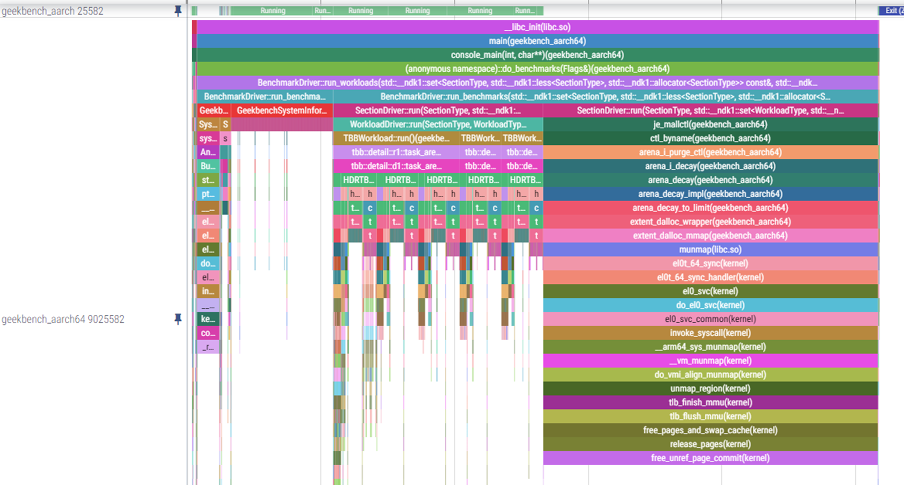

# merge systrace and perfsample output for visualize


---

# Usage Guide

## Capture on Android

```shell
adb shell "atrace --async_start -b 10240 sched freq idle wm am input gfx view"
adb shell "echo mono > /sys/kernel/tracing/trace_clock"

# for cmdline app
adb shell "simpleperf record -e cpu-cycles -f 10000 --call-graph fp -o /data/local/tmp/perf.data -- /data/local/tmp/geekbench_aarch64 --workload 403 --single-core --no-upload"

# for surfaceflinger or any other PID already existed, capture 10 seconds
adb shell "simpleperf record -p $(pidof surfacefinger) -e cpu-cycles -f 10000 --call-graph fp -o /data/local/tmp/perf.data -- sleep 10"

# run your use case

adb shell "atrace --async_stop -z -o /data/local/tmp/trace.atrace"
adb shell "simpleperf report-sample --show-callchain -i /data/local/tmp/perf.data -o /data/local/tmp/sample.txt"
adb pull /data/local/tmp/trace.atrace
# convert from atrace to raw systrace
systrace.py --from-file=trace.atrace -o trace.html
adb pull /data/local/tmp/sample.txt

# merge them to merge.html
perfsample2systrace.py -p sample.txt -t trace.html -o merge.html
```

load merge.html to perfetto https://ui.perfetto.dev or systrace chrome://tracing

## Capture on Linux

```shell
adb push perf_binary to /data/perf, chmod +x /data/perf

cd /sys/kernel/tracing or /sys/kernel/debug/tracing

echo 0 > tracing_on
echo "" > trace
echo 8192 > buffer_size_kb
echo 1 > options/record-tgid
echo mono > trace_clock

echo task:task_newtask                > set_event
echo task:task_rename                 >> set_event
echo cpuhp:cpuhp_enter                >> set_event
echo cpuhp:cpuhp_exit                 >> set_event
echo sched:sched_waking               >> set_event
echo sched:sched_wakeup               >> set_event
echo sched:sched_switch               >> set_event
echo sched:sched_process_exit         >> set_event
echo sched:sched_blocked_reason       >> set_event
echo sched:sched_pi_setprio           >> set_event
echo power:cpu_idle                   >> set_event
echo power:cpu_frequency              >> set_event
echo power:cpu_frequency_limits       >> set_event
echo power:suspend_resume             >> set_event
echo power:clock_enable               >> set_event
echo power:clock_disable              >> set_event
echo power:clock_set_rate             >> set_event
echo clk:clk_enable                   >> set_event
echo clk:clk_disable                  >> set_event
echo clk:clk_set_rate                 >> set_event
echo 1 > tracing_on


/data/perf record -e cpu-cycles -o /data/perf.data -a -g -F 10000 -- sleep 10 (if kuno -F 500 due to weak performance and /proc/sys/kernel/perf_event_max_sample_rate)
# run your use case
echo 0 > tracing_on
/data/perf script -i /data/perf.data > /data/perf_data.txt
cat trace > /data/trace.txt

adb pull /data/perf_data.txt
adb pull /data/trace.txt
# parse and convert

python3 perfsample2systrace.py -p perf_data.txt -t trace.txt -o output.txt

if perf_data.txt only

python3 perfsample2systrace.py -p perf_data.txt -o output.txt
```


## Visualize
load the final html or txt to perfetto https://ui.perfetto.dev or systrace chrome://tracing

